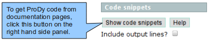

.. _tutorial:

.. currentmodule:: prody

*******************************************************************************
Tutorial
*******************************************************************************

..
    Parser will print what was parsed and how long it took to the screen::

      @> 1p38 (./1p38.pdb.gz) is found in the target directory.
      @> PDBParser: 2962 atoms and 1 coordinate sets were parsed in 0.08s.

    The time printed on the console includes the time that it takes to evaluate 
    coordinate lines and build an :class:`~prody.atomic.AtomGroup` instance and 
    excludes reading the time spend on reading the file from disk.

    If you do not want any logs printed on the screen, you can use 
    :func:`~prody.ProDySetVerbosity` for setting verbosity level.

ProDy is a Python package. Python is a modern, easy to learn and read, 
interpreted, extensible, and multi-platform programming language [BS07]_. User
with scientific interests is referred to `A Primer on Python for Life Science Researchers 
<http://www.ploscompbiol.org/article/info%3Adoi%2F10.1371%2Fjournal.pcbi.0030199>`_
for an introduction to scientific usage of Python.

ProDy can be used:

  * as a command line program via :ref:`scripts`
  * as a part of another Python software/package
  * interactively in a Python interpreter
  
First part of the tutorial shows how to use one of the scripts that is 
distributed with ProDy. Following parts assume user is in an interactive
Python shell. This should be useful for those who may want to write their 
own scripts. 

Upon completion of the tutorial, user is referred to :ref:`examples` section 
that gives more specific and comprehensive usage examples, and also to 
:ref:`reference` section for documentation of all ProDy classes and functions.

Command line usage
===============================================================================

ProDy scripts come with source distribution, which can be downloaded from 
http://pypi.python.org/pypi/ProDy/ (tar.gz file). Latest versions of these 
scripts can also be obtained from https://github.com/abakan/ProDy/tree/master/scripts/.

:ref:`scripts` section shows more detailed information.

Using these scripts is straight forward (on Linux). Let's assume you are
in the same folder as the ANM script. Running the following command will 
perform ANM calculations for p38 MAP kinase structure, and will write 
eigenvalues/vectors in plain text and NMD formats::

  ./python anm.py 1p38
  
In this example, default parameters (``cutoff=15.`` and ``gamma=1.``).
and all alpha carbons of the protein structure 1p38 are used.

In the following, cutoff distance is changed to 14 angstroms, 
alpha carbons of residues with numbers smaller than 340 are used, 
and output files are prefixed with "p38_anm"::

  ./python anm.py -c 14 -s "calpha resnum < 340" -p p38_anm 1p38

Output file :file:`p38_anm.nmd` file can be visualized using |nmwiz|. 

Interactive usage
===============================================================================

In the rest of the tutorial, it is assumed that user is typing commands in a 
Python interpreter window. For such interactive sessions, 
`IPython <http://ipython.scipy.org/>`_ is recommended. 
It offers a nice coloring scheme, and handy features, such as tab completion.

This page and others in the :ref:`examples` section contain code snippets.
These snippets can be retrieved using the "Show Code Snippets" button
on the right hand sidebar:

    
This being said, we start with importing all functions and classes from 
ProDy into the current namespace as follows:

>>> from prody import *

.. note::
   Python commands in this page can easily be copied into a Python file using
   "Code Snippets" bar on the right hand side of the page. 
   Clicking on :guilabel:`Show Code Snippets` will show only Python code 
   snippets in a popup window. The code in the new page can be directly copied 
   into a file. Click on text, press :kbd:`Ctrl+A` and then :kbd:`Ctrl+C`
   to have the text in your clipboard.

Parse a PDB file
-------------------------------------------------------------------------------

Let's start with reading the contents of a PDB file. ProDy offers a fast PDB 
file parser (:func:`~prody.proteins.parsePDB`). For this function to work, 
PDB file does not need to exist on your machine, so long as you have internet 
connection. ProDy will fetch the PDB file if a valid identifier is provided.

>>> prot = parsePDB('1p38')

1p38 is an unbound structure of p38 MAP kinase. :file:`1p38.pdb.gz` has been 
downloaded, and coordinates were parsed into an :class:`~prody.atomic.AtomGroup`
instance.

.. note::
   ProDy prints some log information to the console. The level of verbosity can
   be adjusted using :func:`ProDySetVerbosity` function.

To get some information on the AtomGroup instance, you can type variable name
and press *Enter*.

>>> prot
<AtomGroup: 1p38 (2962 atoms; 1 coordinate sets, active set index: 0)>

There are more ways to access ProteinDataBank (http://www.pdb.org/) content.
See :ref:`parsepdb`, :ref:`fetchpdb`, and :ref:`blastpdb` examples.

List of functions for accessing protein data can also be found in :mod:`prody.proteins`

Select subset of atoms
-------------------------------------------------------------------------------

ProDy :class:`~prody.atomic.AtomGroup` instances offer powerful atom
selection capabilities that are comparable to that of 
`VMD <http://www.ks.uiuc.edu/Research/vmd/>`_. Full list of selection keywords 
are given in section :ref:`selections`. Here, only a few examples are shown:

**Select protein atoms**:

>>> only_protein = prot.select('protein')
>>> only_protein
<Selection: "protein" from 1p38 (2833 atoms; 1 coordinate sets, active set index: 0)>

This shows that 2833 of 2962 atoms are protein atoms. We selected them
using :term:`protein` keyword.

**Select atoms by name**:

We can select side-chain atoms as follows:

>>> side_chain_atoms = prot.select('protein and not name N CA C O')
>>> print side_chain_atoms
Selection "protein and not name N CA C O" from 1p38
>>> len(side_chain_atoms)
1429

Same selection could also be made using :term:`sidechain` keyword or :term:`backbone` keyword
preceded by *not*:

>>> prot.select('sidechain')
<Selection: "sidechain" from 1p38 (1429 atoms; 1 coordinate sets, active set index: 0)>

>>> prot.select('not backbone')
<Selection: "not backbone" from 1p38 (1558 atoms; 1 coordinate sets, active set index: 0)>

Oops, *not* :term:`backbone` did not select the same number of atoms. Let's try to
see why:

>>> print set(prot.select('not backbone').getResidueNames())
set(['CYS', 'ILE', 'VAL', 'GLN', 'LYS', 'HOH', 'PRO', 'THR', 'PHE', 'ASN', 'HIS', 'MET', 'ASP', 'LEU', 'ARG', 'TRP', 'ALA', 'GLU', 'TYR', 'SER'])

Note that we used built-in Python type :class:`set`.

As you can see atoms of **HOH** residues are also included in the selection.

Let's try:

>>> prot.select('not backbone and not water')
<Selection: "not backbone and not water" from 1p38 (1429 atoms; 1 coordinate sets, active set index: 0)>

We also used :term:`water` term. This has now worked as :term:`sidechain` did.
This was to show that it is possible to select same set of atoms in a number 
of different ways. 

**Select amino acids by type/name**:

Let's say we want to select charged residues. We can use :term:`resname`
keyword followed by 3-letter residue names:  

>>> prot.select('resname ARG LYS HIS ASP GLU')
<Selection: "resname ARG LYS HIS ASP GLU" from 1p38 (906 atoms; 1 coordinate sets, active set index: 0)>

Or, we can use predefined keywords :term:`acidic` and :term:`basic`.

>>> charged = prot.select('acidic or basic')
>>> print charged
Selection "acidic or basic" from 1p38
>>> len(charged)
906
>>> set(charged.getResidueNames())
set(['HIS', 'ASP', 'LYS', 'GLU', 'ARG'])

Same selection could also be made using :term:`charged` keyword:

>>> prot.select('charged')
<Selection: "charged" from 1p38 (906 atoms; 1 coordinate sets, active set index: 0)>

.. seealso::
   To see all of what you can do with atom selections, 
   go to :ref:`selections`. Also see :ref:`selection-operations` and 
   :ref:`contacts` for more advanced examples.

Hierarchical view of atoms
-------------------------------------------------------------------------------

:class:`~prody.atomic.AtomGroup` instances has a flat view of atoms in PDB
files, but it is possible to get a hierarchical view (:class:`~prody.atomic.HierView`) 
of them:

>>> hv = prot.getHierView()

Now, one can iterate over chains and residues:

>>> for chain in hv: print chain
Chain A

>>> for res in hv.iterResidues(): print res
GLU 4
ARG 5
PRO 6
THR 7
...

Write a PDB file
-------------------------------------------------------------------------------

PDB files can be written using :func:`~prody.proteins.writePDB` function.
This function accepts objects containing or referring to atomic data.

Writing a selection:

>>> calphas = prot.select('calpha')
>>> writePDB('1p38_calphas.pdb', calphas)
'1p38_calphas.pdb'

Write a chain:

>>> chain_A = hv.getChain('A')
>>> writePDB('1p38_chain_A.pdb', chain_A)
'1p38_chain_A.pdb'

As you might have noticed, this function returns the file name after it is
successfully written.

Perform ANM calculations
-------------------------------------------------------------------------------

Let's perform an ANM analysis for chain A alpha carbon atoms. ANM instances
are instantiated using a name:

>>> anm = ANM('p38')

Hessian matrix can be built for any set of atoms. In this case, we will 
use selection that contains alpha carbon atoms. 

>>> anm.buildHessian(calphas)

Normal modes are calculated by calling :meth:`~prody.dynamics.ANM.calcModes`. 
This will calculate 20 modes by default.

>>> anm.calcModes()

This omits modes with zero eigenvalues. For more information on ANM methods 
see :class:`~prody.dynamics.ANM`.

Individual modes can be accessed by indexing ANM instance:

>>> slowest_mode = anm[0]
>>> print slowest_mode
Mode 1 from ANM p38

Note that indices in Python start from zero (0). 
0th mode is the 1st non-zero mode, in this case.

The following function (:func:`~prody.dynamics.writeNMD`) writes ANM results 
in NMD format. NMD files can be viewed using |vmd| plugin NMWiz. 

>>> writeNMD('p38_anm.nmd', anm[:6], calphas) 
'p38_anm.nmd'

Getting Help
-------------------------------------------------------------------------------

Finally, you might have noticed that ProDy is fully documented. 
In an interactive session help on functions, classes, and class methods can be 
obtained as follows:

>>> help(anm.buildHessian) # doctest: +SKIP
buildHessian(self, coords, cutoff=15.0, gamma=1.0, masses=None) unbound prody.dynamics.ANM method
    Build Hessian matrix for given coordinate set.
<BLANKLINE>
    :arg coords: a coordinate set or anything with getCoordinates method
<BLANKLINE>
    :arg cutoff: cutoff distance (A) for pairwise interactions
    :type cutoff: float, default is 15.0
<BLANKLINE>
    :arg gamma: spring constant
    :type gamma: float, default is 1.0
...

You might need to type ``q`` to quit from help.

If you are using interactive Python shell (IPython), you can also get help
as follows::
  
  prot ?

More examples and information
-----------------------------

For more information see one of:

  * :ref:`examples`
  * :ref:`features`
  * :ref:`reference`
