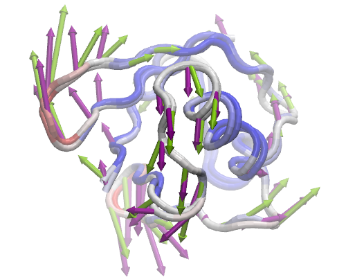
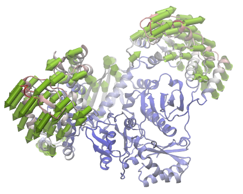

.. _nmwiz-tutorial:

*******************************************************************************
NMWiz Tutorial
*******************************************************************************

Normal Mode Wizard (NMWiz) is a `VMD`_ plugin designed for visual comparative 
analysis of normal mode data, i.e. modes may come from principal component, 
essential dynamics, normal mode analysis or may be any vector describing a 
molecular motion. 

.. _VMD: www.ks.uiuc.edu/Research/vmd/

NMWiz can be used for:

  * drawing normal modes arrows
  * making animations (conformations along a normal mode)
  * plotting square-fluctuations (labeling and highlighting residues)
  * comparing two structures and drawing deformation arrows
  
Following molecular representations are prepared using NMWiz:
  
+--------------------------------------------------+------------------------------------------------+------------------------------------------------+
|                                                  | Example figures                                |                                                |
+==================================================+================================================+================================================+
| .. image:: /_static/gallery/p38_modes_123_sm.png | .. image:: /_static/gallery/p38_anm_pca_sm.png | .. image:: /_static/gallery/p38_network_sm.png |
+--------------------------------------------------+------------------------------------------------+------------------------------------------------+
| ANM modes 1-3 for p38 MAPK                       | ANM and PCA modes for p38                      | p38 network model                              |
+--------------------------------------------------+------------------------------------------------+------------------------------------------------+

NMWiz can also be used to generate trajectories on the fly.  The movie shows 
normal mode representation and animation generated using NMWiz.  Anisotropic 
network model modes were calculated using ProDy.  Movie was generated using 
`VMD Movie Plugin <http://www.ks.uiuc.edu/Research/vmd/plugins/vmdmovie/>`_.

.. only:: html

   .. youtube:: 1OUzdzm68YY
      :width: 400

Experiment vs. Theory
===============================================================================

We will use ProDy Interface of NMWiz plugin to perform a comparative analysis 
of ubiquitin dynamics predicted using theory using anisotropic network model
(ANM) and inferred from experimental structures using principal component 
analysis (PCA).

Let's fetch a PDB files that contains a solution (NMR) structure using 
:ref:`prody-fetch` command::

  $ prody fetch 2k39

Alternatively, you may use a browser to download these files.  
:file:`2k39.pdb` file can be loaded into VMD at startup as follows::

  $ vmd 2k38.pdb
  
This file contains 116 solution structure models of the protein Ubiquitin, so 
it will be suitable for comparison of theoretical predictions with experimental
data. 

:guilabel:`NMWiz - Main` window can be accessed via the 
:menuselection:`Extensions --> Analysis` menu of :guilabel:`VMD Main` 
window.  Click on :guilabel:`ProDy Interface` and a window listing 
molecules and ProDy jobs will pop up.

Atom Selection
-------------------------------------------------------------------------------

In both ANm and PCA calculations, we will omit the flexible C-terminal tail of 
ubiquitin, since incorporating this flexible tail skews the calculations and 
results highlight local tail motions instead of collective global motions that 
we are interested in.
 
We enter the selection string ``resid <= 70 and protein and name CA`` and 
click :guilabel:`Select`.  70 Cα atoms will be selected for calculations.

ANM Calculation
-------------------------------------------------------------------------------

First, we perform ANM calculations, which is the job type selected by default.  
We will use 78th NMR model for ANM calculations, because this model is the 
closest to the average of the ubiquitin NMR ensemble. Since VMD frame (model) 
numbers start from 0, we will change the :guilabel:`Frame number` to read 77.

   
   PC 2 (purple) vs. ANM mode 2 (lime green)

We keep the rest of the parameters unchanged, and click :guilabel:`Submit Job`.
This action will run :ref:`prody-anm` command in the background and load the
results when calculations are finished.    

PCA Calculation
-------------------------------------------------------------------------------

Now, we will use all ubiquitin models for the PCa calculation.  Select
:guilabel:`PCA Calculation` in the :guilabel:`ProDy Job Settings` panel.
Keeping :guilabel:`PCA (EDA) Settings` unchanged, click :guilabel:`Submit Job`.
Results will be loaded automatically when :ref:`prody-pca` command finishes
the calculations. 

Comparison
-------------------------------------------------------------------------------

For each dataset you load into or generate via NMWiz, a GUI will pop up with
independent controls for normal mode display, animation, and plotting. Select
PC 2 and ANM mode 2 and try to get the view in the image in VMD display.   

Clicking on :guilabel:`Options` buttons will expand the GUI showing more 
controls for fine tuning the display.  Exploring these options is left
to you.  You can adjust the quality of the arrows and protein to get a 
publication quality image.  In addition, you can make mobility plots and
generate animations for the selected mode.   
  
ANM vs. MD Simulations
===============================================================================

In this part, we will perform essential dynamics analysis calculations
for a p38 MAP kinase trajectory and compare results with normal modes from
ANM calculations.  p38 files can be downloaded from :download:`p38 trajectory 
<p38_trajectory.tar.gz>`.  The :file:`p38_100frames.dcd` is from a 40 ns
long simulation of p38.  Detailed analysis of this trajectory can be 
found in [AB11]_.

Load the contents of this file into VMD as follows::

  $ tar -xzf p38_trajectory.tar.gz
  $ vmd p38.pdb p38_100frames.dcd

Click on :guilabel:`ProDy Interface` for performing ANM and EDA jobs.

ANM Calculation
-------------------------------------------------------------------------------

We will perform ANM calculations for all Cα atoms and keep the rest of the 
parameters unchanged.  Click :guilabel:`Submit Job` and results obtained from
:ref:`prody-anm` command will load automatically.    

.. figure:: nmwiz_p38_EDA1vsANM1.png
   :align: right
   :scale: 50 %
   :target: ../_images/nmwiz_p38_EDA1vsANM1.png
   
   EDA 1 (orange) vs. ANM mode 2 (lime green)

EDA Calculation
-------------------------------------------------------------------------------

Select :guilabel:`PCA Calculation` in the :guilabel:`ProDy Job Settings` panel.
Set :guilabel:`First frame` 1 to exclude the X-ray coordinates from the 
calculation.  You may also check :guilabel:`aligned` to make ProDy skip
alignment step in PCA/EDA calculations when you already have done the alignment
in VMD. In this case, the frames are already aligned. 
Click :guilabel:`Submit Job` and results will be loaded automatically when 
:ref:`prody-pca` command finishes the calculations. 

Comparison
-------------------------------------------------------------------------------

For each dataset you load into or generate via NMWiz, a GUI will pop up with
independent controls for normal mode display, animation, and plotting. Select
PC 2 and ANM mode 2 and try to get the view in the image in VMD display.   

Suggestions
-------------------------------------------------------------------------------

NMWiz writes a DCD or PDB file for PCA/EDA calculations.  For large systems
and long trajectories you may try one or more of the following for speedier
calculations:

  * select a subset of atoms, e.g. Cα atoms
  * select a subset of frames, e.g. set :guilabel:`Skip frame` a value
    greater than 0
  * use :guilabel:`DCD file` for faster IO operations and less disk usage
  * alternatively, if you have trajectories in DCD format, use :ref:`prody-pca`
    directly to obtain results in :ref:`nmd-format`

Extending a Model
===============================================================================

In previous calculations, we used Cα atoms and the results retrieved from
ProDy contained only a trace of the structure.  VMD requires more information
(at least a complete backbone) for displaying cartoon and ribbon 
representation of proteins which are suitable for publications.  In this
part, we will use :guilabel:`Extend model to` option for extending the
model to backbone atoms of the protein.

   
   ANM mode 1 for HIV Reverse Transcriptase
   
ANM Calculation
-------------------------------------------------------------------------------

Let's fetch an X-ray structure of the protein HIV reverse transcriptase (RT)
and load into VMD::

  $ prody fetch 1dlo
  $ vmd 1dlo.pdb
  
In the :guilabel:`ProDy Interface`, we select :guilabel:`ANM Calculation`,
check :guilabel:`backbone` option, and click :guilabel:`Submit Job`.  
Model will be calculated for 971 selected Cα atoms, but the normal modes will 
be extended to all backbone atoms.

Visualization
-------------------------------------------------------------------------------

When the results are loaded, you will see four arrows per residue (or node).
Change the :guilabel:`Selection` string to read ``name CA`` and click 
:guilabel:`Redraw`.  This will draw only one arrow per mode.

RT is a large structure and updating the display with every little change you
make might be time consuming.  You can uncheck :guilabel:`auto update graphics`
option in :guilabel:`Mode Graphics Options` panel.  

To get the view displayed in the figure, you will need to hide arrows that
are shorter than a given length using :guilabel:`Draw if longer than` option
and draw an arrow for every forth residue using the selection
``name CA and resid % 4 == 0``. The protein representation is *NewCartoon*.

Animation
-------------------------------------------------------------------------------

You can generate a trajectory along the selected mode by clicking 
:guilabel:`Make` in :guilabel:`Animation` row. For large proteins,
keeping the :guilabel:`Graphics resolution` low (10) will make
the animation run smoother.
