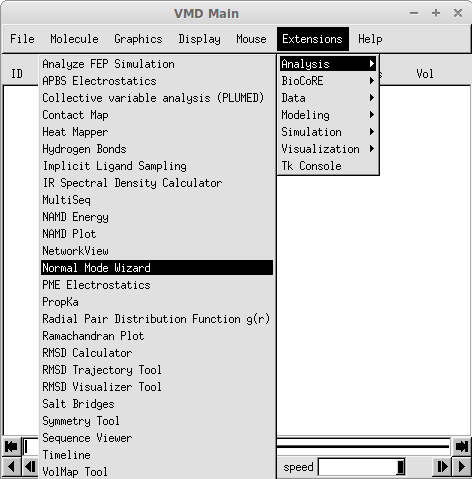
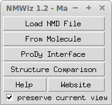
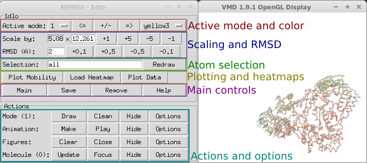
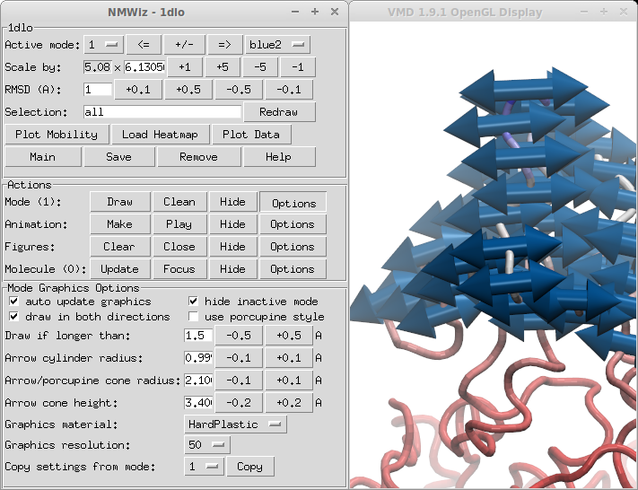

Using NMWiz
===============================================================================

This chapter provides an introduction to NMWiz and its capabilities 
using the 

Main Window
-------------------------------------------------------------------------------

NMWiz is located in :menuselection:`VMD Main --> Extensions --> Analysis` menu
and labeled as :guilabel:`Normal Mode Wizard`.   

   
   Location of NMWiz plugin in VMD menus.

You will see the :guilabel:`NMWiz 1.2 - Main` window.   

   
   NMWiz Main window.

:guilabel:`NMWiz 1.2 - Main` window offers options to load precalculated data
or to generate data for molecules loaded in VMD:

  * :guilabel:`Load NMD File` let's you load precalculated data (:file:`.nmd`
    files) for analysis.

  * :guilabel:`From Molecule` let's you load precalculated data stored in
    molecular data formats recognized by VMD.  

  * :guilabel:`ProDy interface` allows for performing ANM, GNM, and PCA/EDA 
    calculations.  This functionality is illustrated in the following chapters.
    
  * :guilabel:`Structure Comparison` allows for calculating, depicting, and 
    animating deformation between two frames of the same molecule or two 
    separate structures.

NMD Format
-------------------------------------------------------------------------------

NMD files (extension :file:`.nmd`) are plain text files that contain at least 
normal mode and coordinate data. In addition to PCA, EDA, NMA, ANM, or GNM 
data, arbitrary vectors can be stored in NMD files.  Following data fields 
are recognized:

  * **coordinates**: Coordinates must be provided in one line as a list of 
    decimal numbers. Number of atoms in the system is deduced from size of 
    this data line. 
  * **mode**: Normal mode array. Each normal mode array must be provided in 
    one line as a list of decimal numbers. Mode array may be preceded by mode
    index and mode length (square root of variance or inverse frequency). 
  * *title*: A title for the dataset. 
  * *names*: Atom names. Default is "CA" for all atoms. 
  * *resnames*: Residue names. Default value is "GLY". 
  * *chainids*: Chain identifiers. Default value is "A". 
  * *resids*: Residue numbers. If this data line if not found, residue numbers
    are started from 1 and incremented by one for each atom. 
  * *betas*: Beta factors. Default value is 0 (zero). B-factors are used to 
    color the protein representation.

.. note::
   All data types must be listed in a single line. The size of data lines must
   match the number of atoms in the system, i.e. the size of coordinates line.

For example, :file:`1dlo_anm.nmd` contains the following line:

.. literalinclude:: nmwiz_tutorial_files/1dlo_anm.nmd

The first line in this file contains ``nmwiz_load 1dlo_anm.nmd`` command.  
With this, you can make :program:`vmd` load this file first thing when it 
starts:: 

  $ vmd -e 1dlo_anm.nmd

.. note::
   Any data field name that is not recognized by NMWiz, such as 
   ``nmwiz_load 1dlo_anm.nmd`` will be omitted.

NMWiz Window
-------------------------------------------------------------------------------

Now, let's load :file:`1dlo_anm.nmd` file to introduced the :guilabel:`NMWiz`
window:

   
   :guilabel:`NMWiz` GUI

Changing and Editing Modes
^^^^^^^^^^^^^^^^^^^^^^^^^^

Active mode and color
"""""""""""""""""""""

Active mode can be changed using the drop down menu or :guilabel:`<=` and
:guilabel:`=>` buttons. Changing the active mode will hide previously
generated depiction.  Newly depicted mode will have a distinct color.

Mode direction
""""""""""""""

NMWiz depicts normal modes as they are read from the input file, but 
:guilabel:`+/-`

Mode options
""""""""""""

   
   :guilabel:`Mode Graphics Options` panel

:guilabel:`Mode Graphics Options` panel allows for customizing the look

.. note::
   Mode representation is not redrawn after eac

Scaling and RMSD
""""""""""""""""

Atom selections
"""""""""""""""

Editing Molecule Representation
^^^^^^^^^^^^^^^^^^^^^^^^^^^^^^^

Making Animations
^^^^^^^^^^^^^^^^^

Plotting and Heatmaps
^^^^^^^^^^^^^^^^^^^^^

Main Controls
^^^^^^^^^^^^^

Use the following controls for:

  * :guilabel:`Main` - open NMWiz main window, useful when it's closed
  * :guilabel:`Save` - save current dataset in NMWiz format
  * :guilabel:`Remove` - remove current dataset and free memory
  * :guilabel:`Help` - get some help

Efficiency Tips
^^^^^^^^^^^^^^^

Displaying large number of primitive graphics for large molecules may make
your system unresponsive.  You can try some of the following tricks to 
speed up drawing arrows and manipulating the view. 

Show some of modes
""""""""""""""""""

  * Show subset of arrows evenly distributed in the molecular system 
    by making a selection using ``%``:
    
    * ``index % 2 == 0`` - shows every other mode
      
    * ``resid % 4 == 0`` - shows every mode for every forth residue
    
    You need to enter these strings to :guilabel:`Selection` box.

  * Draw modes that are longer than a threshold length using the options
    in :guilabel:`Mode Graphics Options` in Figure 2.4.
  
Depending on the molecule one or both of these tricks can provide a more 
responsive experience and a better (less crowded) depiction of motions. 

   
